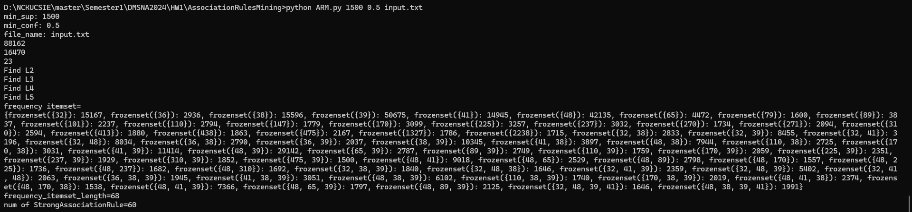
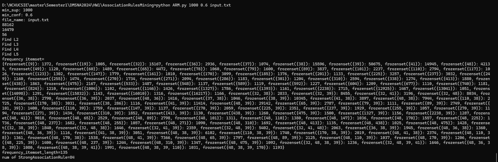
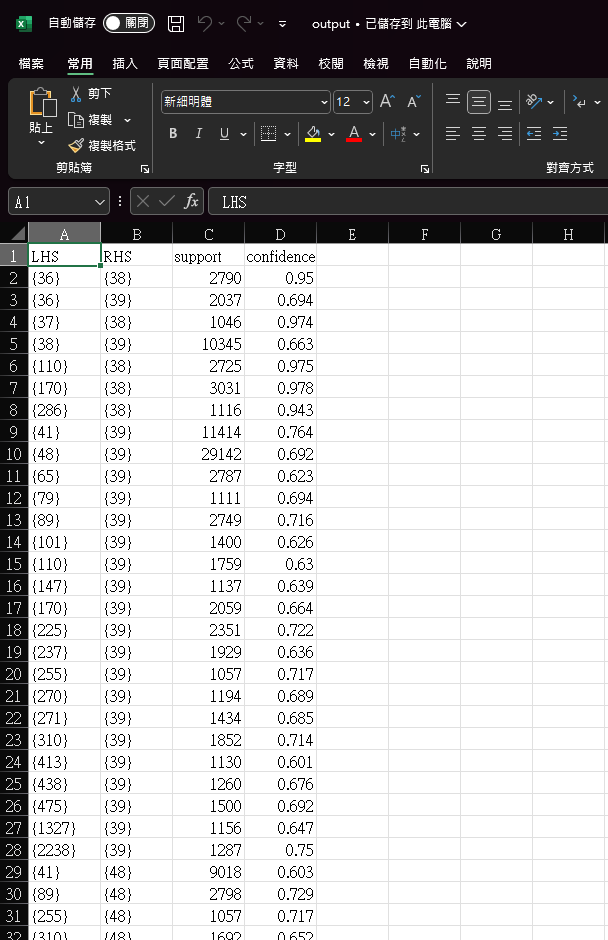

# AssociationRulesMining
## 執行方式
> python ARM.py min_sup數值 min_conf數值 input.txt

例如:
> python ARM.py 1500 0.5 input.txt

> pyhton ARM.py 1000 0.6 input.txt

### TestCase1
> **min_sup=1500,min_conf=0.5**
num of freqency_itemset is 68
num of StrongAssociationRule is 60

### TestCase1
> **min_sup=1000,min_conf=0.6**
num of freqency_itemset is 135
num of StrongAssociationRule is 84

## 輸出檔
我有將結果輸出成一份csv檔，column name包含LHS(rule的左手邊),RHS(rule的右手邊),support(為整數),confidence

